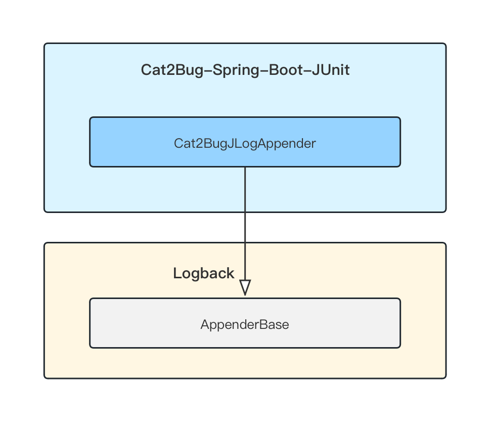
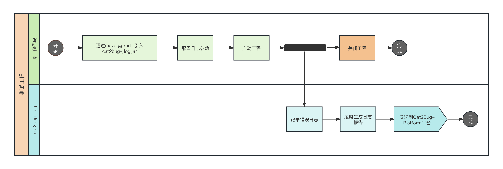
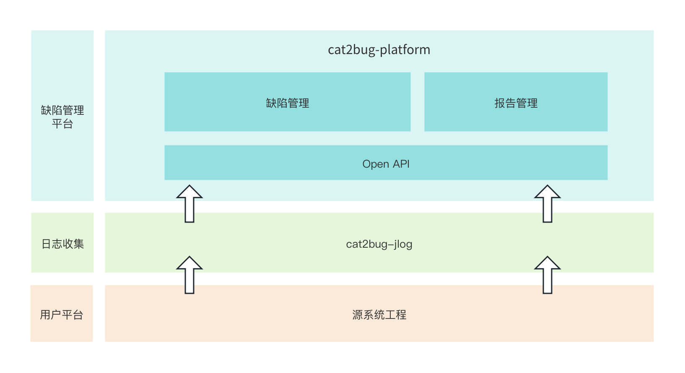
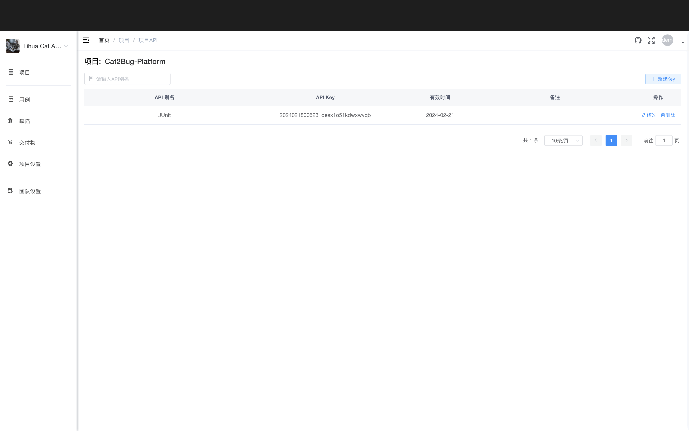
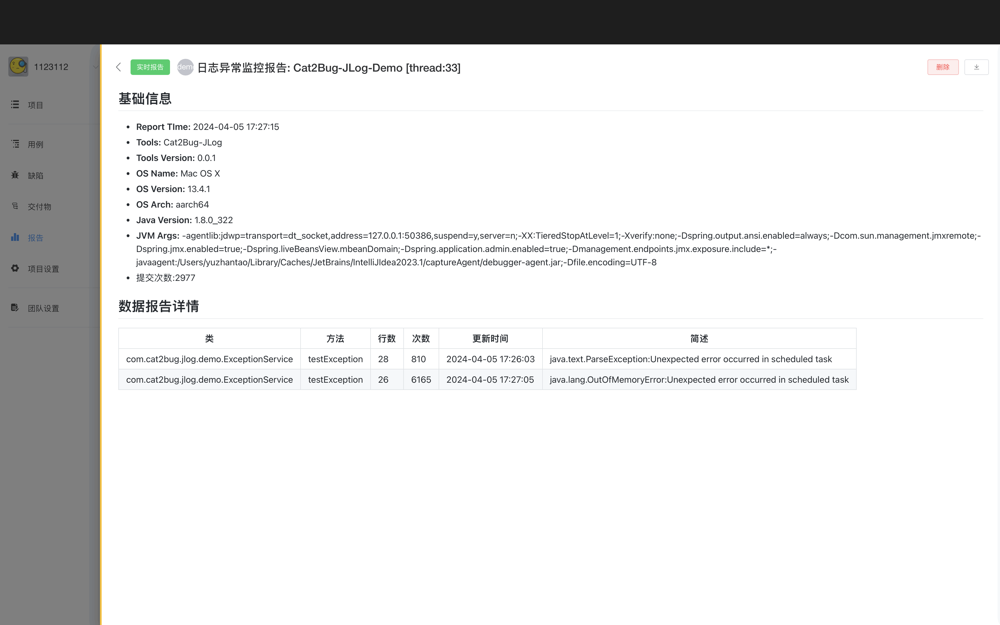
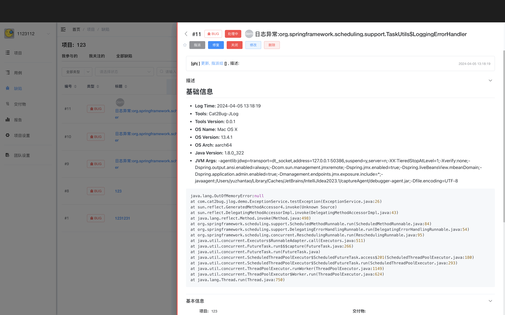

# Cat2Bug-JLog

## 介绍
[Cat2Bug-JLog](https://gitee.com/cat2bug/cat2bug-jlog) 是[Cat2Bug](https://www.cat2bug.com) 推出的Java 错误日志收集框架，通过简单的配置，可以将系统运行中的错误日志提交到BUG系统，提高项目管理运维的效率。

## 连接
* 官网: https://www.cat2bug.com
* library github: https://github.com/cat2bug/cat2bug-jlog
* library gitee: https://gitee.com/cat2bug/cat2bug-jlog

## 技术架构

Cat2Bug-JLog以Logback为基础,实时监控指定类的异常日志，并将异常信息形成报告推送到[Cat2Bug-Platform](https://gitee.com/cat2bug/cat2bug-platform) 管理平台。



## 运行流程



## 优势与特点

* 轻量化的日志收集框架，减少测试人员反复登陆服务器查看日志，加强服务器的稳定与安全。
* 基于Cat2Bug生态圈中，可以结合[Cat2Bug-Platform](https://gitee.com/cat2bug/cat2bug-platform)平台监管系统的生命周期，通过多样性的可视化报表辅助项目经理了解系统的实时状态。

## 安装

*  Gradle
```javascript
testImplementation ("com.cat2bug:cat2bug-jlog-core:0.0.1")
```

* Maven

```xml
<dependency>
    <groupId>com.cat2bug</groupId>
    <artifactId>cat2bug-jlog-core</artifactId>
    <version>0.0.1</version>
    <scope>test</scope>
</dependency>
```

## 在Cat2Bug生态下使用

目前[Cat2Bug-JLog](https://gitee.com/cat2bug/cat2bug-jlog)可以结合[Cat2Bug-Platform](https://gitee.com/cat2bug/cat2bug-platform)平台无缝联合使用，
[Cat2Bug-JLog](https://gitee.com/cat2bug/cat2bug-jlog) 负责错误日志的收集，并将收集后的异常报告通过Open API推送到[Cat2Bug-Platform](https://gitee.com/cat2bug/cat2bug-platform)平台，
[Cat2Bug-Platform](https://gitee.com/cat2bug/cat2bug-platform)平台则用于管理报告中的异常缺陷，并可导出相关测试报告，其生态架构如下：



### Cat2Bug-Platform环境的创建

如果需要在单元测试完成后，将测试失败的缺陷结果提交到BUG系统，需先部署[Cat2Bug-Platform](https://gitee.com/cat2bug/cat2bug-platform)平台，并设置API KEY，以下介绍一种快速部署方式，更多详情请参阅[Cat2Bug官网文档](https://www.cat2bug.com)。

1. Docker下载[Cat2Bug-Platform](https://hub.docker.com/r/cat2bug/cat2bug-platform)容器并部署，执行代码如下：
````
docker run -it -d -p 8022:8022 --name cat2bug-platform cat2bug/cat2bug-platform:latest
````

启动成功后，在浏览器访问http://127.0.0.1:8022， 如果可以正常访问，代表平台启动成功；

2. 在[Cat2Bug-Platform](https://gitee.com/cat2bug/cat2bug-platform)平台,依次注册用户，创建团队，创建项目后，在项目设置的API KEY中，添加一个KEY，用于单元测试提交报告的鉴权用，界面如下：



至此，[Cat2Bug-Platform](https://gitee.com/cat2bug/cat2bug-platform)环境已经创建完成。

## 使用说明

在引用cat2bug-jlog.jar之后，在项目./src/main/resources目录下建立logback-spring.xml文件进行相关配置，代码如下：

````xml
<configuration>
    <appender name="stdout" class="ch.qos.logback.core.ConsoleAppender">
        <encoder class="ch.qos.logback.classic.encoder.PatternLayoutEncoder">
            <!--格式化输出：%d表示日期，%thread表示线程名，%-5level：级别从左显示5个字符宽度%msg：日志消息，%n是换行符-->
            <pattern>%d{yyyy-MM-dd HH:mm:ss.SSS} [%thread] %-5level %logger{50} - %msg%n</pattern>
        </encoder>
    </appender>
    <appender name="cat2bugAppender" class="com.cat2bug.jlog.Cat2BugJLogAppender">
        <projectName>Cat2Bug-JLog-Demo</projectName>
        <host>http://127.0.0.1:2020/</host>
        <projectKey>20240328193039fv0gj0ckq5g3nx1h</projectKey>
        <handler>demo</handler>
        <banner>true</banner>
        <logCacheSize>100</logCacheSize>
        <reportPushTime>5000</reportPushTime>
        <monitorPackages>com.cat2bug.jlog.demo</monitorPackages>
        <monitorThrowable>java.lang.RuntimeException</monitorThrowable>
    </appender>
    <root level="INFO">
        <appender-ref ref="stdout"/>
        <appender-ref ref="cat2bugAppender" />
    </root>
</configuration>
````
其中appender的name等于cat2bugAppender的配置即为[Cat2Bug-JLog](https://gitee.com/cat2bug/cat2bug-jlog) 异常日志收集框架，其中相关参数说明如下：


| 参数名              | 类型  | 是否必填 | 功能描述                                                    |
|------------------|-----|------|---------------------------------------------------------|
| projectName      | 字符串 | 是    | 当前项目名称，用于显示报告标题。                                        |
| projectVersion   | 字符串 | 否    | 当前项目版本。                                                 |
| host             | 字符串 | 是    | Cat2Bug-Platform平台的Open API网址。                          |
| projectKey       | 字符串 | 是    | 应用配置中的Key。                                              |
| handler          | 字符串 | 否    | 推送异常日志的处理人，指在Cat2Bug-Platform平台注册的用户登陆名。                |
| logCacheSize     | 整形  | 否    | 不同异常日志缓存的最大尺寸，如果大于等于最大缓存数量，框架会形成报告推送缓存数据到Bug平台，并清除当前缓存。 |
| reportPushTime   | 整形  | 否    | 推送报告的间隔时间，单位为毫秒，默认值为600000。                             |
| monitorPackages  | 字符串 | 否    | 指明监控哪些包或类，默认为空，不设置代表监控所有类异常。                            |
| monitorThrowable | 字符串 | 否    | 指明监控哪些报错的异常类，默认为空，不设置代表监控所有异常类。                         |
| ignorePackages   | 字符串 | 否    | 指明忽略监控哪些包或类，默认为空，不设置代表监控所有类异常。                          |
| ignoreThrowable  | 字符串 | 否    | 指明忽略监控哪些报错的异常类，默认为空，不设置代表监控所有异常类。                       |

通过添加以上配置，即可自动收集异常日志，下图为[Cat2Bug-Platform](https://gitee.com/cat2bug/cat2bug-platform) 平台收到的异常日志报告及异常转为缺陷的列表，如下图：





相关测试Demo，请参阅源代码中cat2bug-jlog-demo工程。

## 未来计划

目前[Cat2Bug-JLog](https://gitee.com/cat2bug/cat2bug-jlog) 还在持续成长中，后续我们将不断完善框架的功能。2024-2025年计划如下：

* 添加智能报告统计功能；
* 针对异常日志添加异常处理方案功能；

## Cat2Bug交流群

| QQ群： [731462000](https://qm.qq.com/cgi-bin/qm/qr?k=G_vJa478flcFo_1ohJxNYD0mRKafQ7I1&jump_from=webapi&authKey=EL0KrLpnjYWqNN9YXTVksNlNFrV9DHYyPMx2RVOhXqLzfnmc+Oz8oQ38aBOGx90t) | 微信群：Cat2Bug                                                                 |
|--------------------------------------------------------------------------------------------------------------------------------------------------------------------------------|-----------------------------------------------------------------------------|
|                                                                                                         |  |
